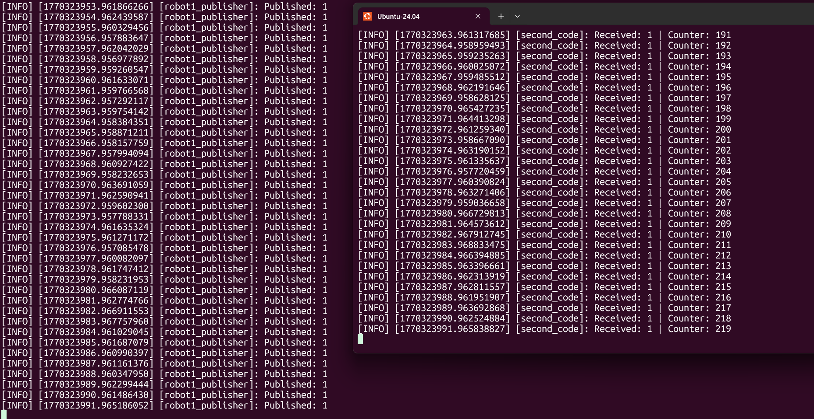

# activity ROS2 #

This project implements a simple **ROS 2 publisher–subscriber architecture** using two custom nodes.  
A constant number is published periodically, received by a second node, accumulated in a counter, and then republished with the updated value.

## Node Description

### 1. `robot1_publisher` Node

- **Published Topic:** `/robot_pub1`
- **Message Type:** `example_interfaces/msg/Int64`
- **Publishing Rate:** 1 message per second
- **Functionality:**
  - Always publishes the value `1`
  - Logs each published value to the terminal

---

### 2. `second_code` Node

This node subscribes to the published number, accumulates it, and republishes the result.

- **Subscribed Topic:** `/robot_pub1`
- **Published Topic:** `/robot_pub2`
- **Message Type:** `example_interfaces/msg/Int64`
- **Functionality:**
  - Maintains an internal counter
  - Adds each received number to the counter
  - Publishes the updated counter value immediately from the subscriber callback


## Node Implementation

### robot1_publisher Node Code

```python
import rclpy
from rclpy.node import Node
from example_interfaces.msg import Int64

# Node that publishes a constant number periodically
class numPublisher(Node):
    def __init__(self):
        super().__init__("robot1_publisher")

        self.publisher_ = self.create_publisher(Int64, "/robot_pub1", 10)
        self.create_timer(1.0, self.number)

        self.number = 1
        self.get_logger().info("Sending number")

    def number(self):
        msg = Int64()
        msg.data = self.number
        self.publisher_.publish(msg)
        self.get_logger().info(f"Published: {msg.data}")

def main(args=None):
    rclpy.init(args=args)
    my_publisher_node = numPublisher()
    rclpy.spin(my_publisher_node)
    rclpy.shutdown()

if __name__ == "__main__":
    main()
```

---

### second_code Node Code

```python
import rclpy
from rclpy.node import Node
from example_interfaces.msg import Int64

class myNode_function(Node):
    
    def __init__(self):
        super().__init__('second_code')
        self.counter = 0
        self.get_logger().info('beep Boop R2D2 is operational.')

        self.subscriber = self.create_subscription(
            Int64,
            "/robot_pub1",
            self.callback_receive_info,
            10
        )

        self.publisher = self.create_publisher(Int64, "/robot_pub2", 10)
    
    def callback_receive_info(self, msg: Int64):
        self.counter += msg.data
        out_msg = Int64()
        out_msg.data = self.counter
        self.get_logger().info(
            f"Received: {msg.data} | Counter: {self.counter}"
        )
        self.publisher.publish(out_msg)

def main(args=None):
    rclpy.init(args=args)
    second_code = myNode_function()
    rclpy.spin(second_code)
    rclpy.shutdown()

if __name__ == "__main__":
    main()
```

---

---

> **Blue boxes represent nodes, and green boxes represent topics.**

---

## System Architecture


- **Nodes**
  - `robot1_publisher`
  - `second_code`

- **Topics**
  - `/robot_pub1`
  - `/robot_pub2`

---
