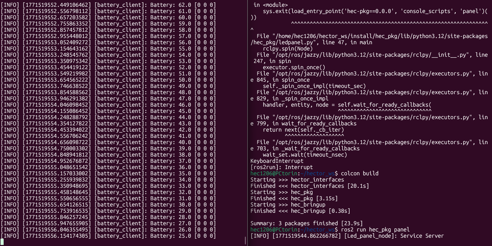

# Activity custom service ROS2 #

In this project, a distributed system was developed in ROS 2 that simulates the behavior of a battery and its interaction with an LED panel through communication based on services and topics.

The system is composed of two main nodes:

---

## Battery Node (Client)

This node simulates the battery level of the system:
 The battery starts at 100% It gradually discharges down to 0% when it reaches 0%, it switches to charging mode it recharges back up to 100% the cycle repeats indefinitely the node uses a timer to periodically update the battery level.

When the battery reaches:
0% → it sends a request to the server to turn the LED on
100% → it sends a request to turn the LED off
This node acts as a service client (SetLed).

Additionally, it subscribes to the HecStatus topic to monitor the actual state of the LED and display it in the terminal, ensuring synchronization with the server.

---

## Panel led Node (Server)

This node represents the LED hardware controller.

Its responsibilities are:

Maintain the current LED state (for example, [0,0,0] or [0,0,1]) continuously publish that state on the HecStatus topic receive requests through the SetLed service change the LED state according to the boolean value received in the request the server does not make decisions about the battery. it simply executes the commands sent by the client.


---
## Explenatation Code Battery 
---

we need both services and messages customs in the code because we need to send to request´s and recieve the constant messages

```basch
import rclpy
from rclpy.node import Node

from hector_interfaces.msg import LedPanel
from hector_interfaces.srv import Setled

```
but what we are importing? in other package  *hector_interfaces *we have two folders one call srv and the oder msg

In the services we have the battery level the request the charging and the response in this case is call success

```basch
float32 battery_level
bool request
bool charging
---
bool success
```
In the msg we have the led state

```basch
    int32[] led
```
the principal main importance of this code is has a suscriber and has code of client

```basch

class BatteryClient(Node):

    def __init__(self):
        super().__init__("battery_client")

        self.client = self.create_client(Setled, "Setled")
        while not self.client.wait_for_service(timeout_sec=1.0):
            self.get_logger().info("Waiting for service 'set_led'...")
        
        
        self.charging = False   
        self.battery_level = 100.0  # empieza bajo para prueba rápida
        self.current_led = [0, 0, 0]

        self.timer = self.create_timer(0.1, self.update_battery)
        self.subscriber = self.create_subscription(LedPanel, "HecStatus",self.led_callback,10)

    def led_callback(self, msg):
        self.current_led = msg.led

```
---

then next part has the functions that gets the battery to cero and then charges also the request when gets the value 0 and the part of the future to prevent errors

```basch

    def update_battery(self):

        if self.charging:
            self.battery_level += 1.0
        else:
            self.battery_level -= 1.0
            self.get_logger().info(f"Battery: {self.battery_level} {self.current_led}")

        if self.battery_level <= 0.0:
            self.battery_level = 0.0
            self.charging = True
            self.send_request(True)

        if self.battery_level >= 100.0:
            self.battery_level = 100.0
            self.charging = False
            self.send_request(False)

    def send_request(self, state):
        request = Setled.Request()
        request.battery_level = self.battery_level
        request.request = state

        future = self.client.call_async(request)
        future.add_done_callback(self.response_callback)

    def response_callback(self, future):
        response = future.result()

        if response.success:
            self.get_logger().info("charging battery.")
```
---
## **Full code**
battery code:

---
```python

#!/usr/bin/env python3

import rclpy
from rclpy.node import Node

from hector_interfaces.msg import LedPanel
from hector_interfaces.srv import Setled

class BatteryClient(Node):

def __init__(self):
    super().__init__("battery_client")

    self.client = self.create_client(Setled, "Setled")
    while not self.client.wait_for_service(timeout_sec=1.0):
        self.get_logger().info("Waiting for service 'set_led'...")
        self.charging = False   
        self.battery_level = 100.0  # empieza bajo para prueba rápida
        self.current_led = [0, 0, 0]

        self.timer = self.create_timer(0.1, self.update_battery)
        self.subscriber = self.create_subscription(LedPanel, "HecStatus",self.led_callback,10)

def led_callback(self, msg):
    self.current_led = msg.led

def update_battery(self):

    if self.charging:
         self.battery_level += 1.0
    else:
        self.battery_level -= 1.0

    self.get_logger().info(f"Battery: {self.battery_level} {self.current_led}")

    if self.battery_level <= 0.0:
        self.battery_level = 0.0
        self.charging = True
        self.send_request(True)

    if self.battery_level >= 100.0:
        self.battery_level = 100.0
        self.charging = False
        self.send_request(False)

    def send_request(self, state):
        request = Setled.Request()
        request.battery_level = self.battery_level
        request.request = state

        future = self.client.call_async(request)
        future.add_done_callback(self.response_callback)

    def response_callback(self, future):
        response = future.result()

        if response.success:
            self.get_logger().info("charging battery.")

def main(args=None):
    rclpy.init(args=args)
    node = BatteryClient()
    rclpy.spin(node)
    rclpy.shutdown()

if __name__ == "__main__":
    main()
```
---

## Explenatation Code led Panel 

In this code the important its the creation of the service and the publisher

```basch
class RobotstatusPublisher(Node):

    def __init__(self):
        super().__init__('Led_panel_node') #MODIFY NAME

        self.walle = self.create_publisher(LedPanel, "HecStatus", 10)

        self.led = [0, 0, 0] 
        self.timer = self.create_timer(0.1, self.publish_led)

        self.server_= self.create_service(Setled, #Service TYPE
                                          "Setled", #service Name
                                          self.add_two_ints_callback 
                                          )
        self.get_logger().info("Service Server")

    def publish_led(self):
        msg = LedPanel()
        msg.led = self.led
        self.walle.publish(msg)

    def add_two_ints_callback(self, request: Setled.Request, response: Setled.Response):
        if request.request:

            self.get_logger().info(
                f"Battery reached {request.battery_level}"
            )
            self.led = [0, 0, 1] 
            response.success = True
        else:
            response.success = False
            self.led = [0, 0, 0] 
        return response 
```
---

## **Full code**

---
```python
##!/usr/bin/env python3

import rclpy
from rclpy.node import Node
from hector_interfaces.srv import Setled
from hector_interfaces.msg import LedPanel


class RobotstatusPublisher(Node):
    
    def __init__(self):
        super().__init__('Led_panel_node') #MODIFY NAME

        self.walle = self.create_publisher(LedPanel, "HecStatus", 10)

        self.led = [0, 0, 0] 
        self.timer = self.create_timer(0.1, self.publish_led)

        self.server_= self.create_service(Setled, #Service TYPE
                                          "Setled", #service Name
                                          self.add_two_ints_callback 
                                          )
        self.get_logger().info("Service Server")

    def publish_led(self):
        msg = LedPanel()
        msg.led = self.led
        self.walle.publish(msg)


    def add_two_ints_callback(self, request: Setled.Request, response: Setled.Response):
        if request.request:

            self.get_logger().info(
                f"Battery reached {request.battery_level}"
            )
            self.led = [0, 0, 1] 
            response.success = True
        else:
            response.success = False
            self.led = [0, 0, 0] 
        return response          

def main(args=None):
    rclpy.init(args=args)
    Node = RobotstatusPublisher()
    rclpy.spin(Node)
    rclpy.shutdown()

if __name__ == "__main__":
    main()
```
---
## Results

When the baterry is in use normal 



When the baterry is charging


---