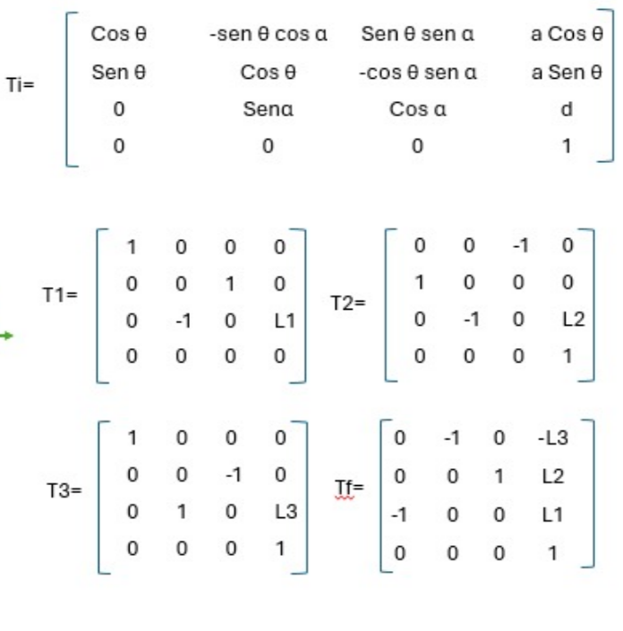
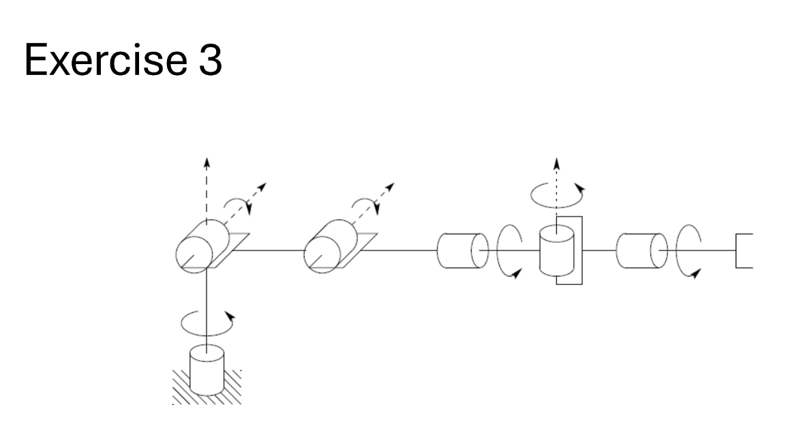
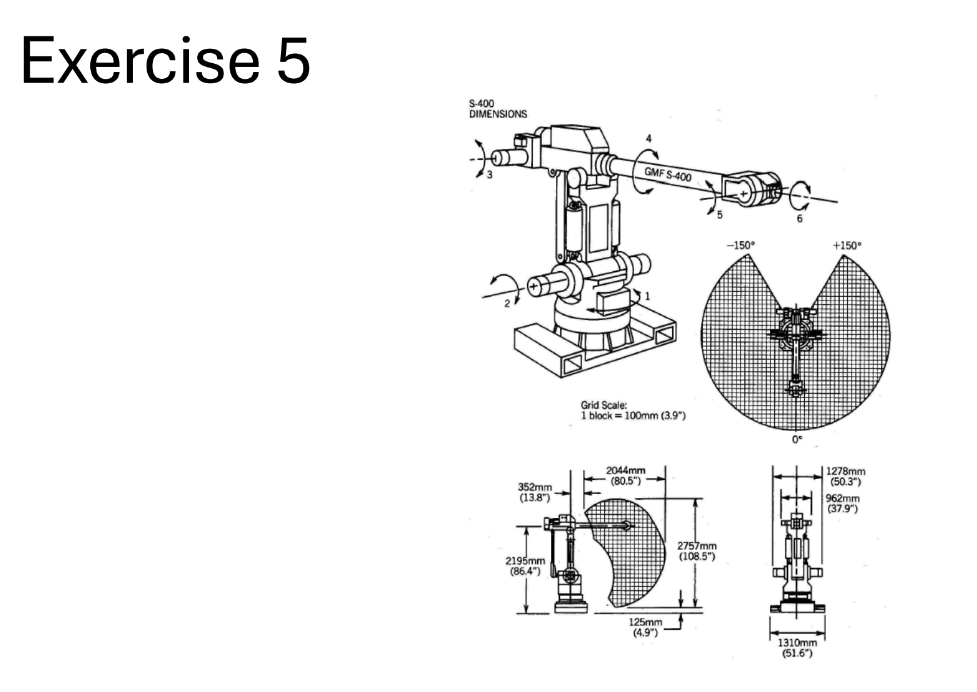
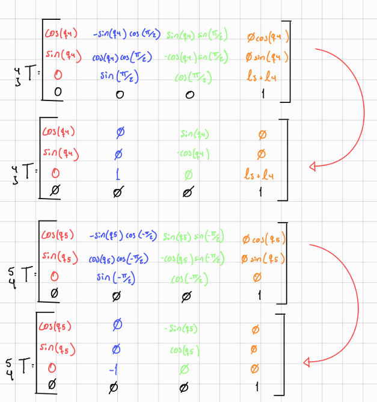

# Forward Kinematics 

This repository is used to document *Denavit–Hartenberg (DH) frame placement* and *homogeneous transformation matrices* for multiple robots.

## Introduction

The **Denavit–Hartenberg (D–H) Convention** is a standardized method used in robotics to model the kinematics of serial manipulators. Its main purpose is to provide a systematic way to assign coordinate frames to each link of a robotic mechanism and to describe the spatial relationship between consecutive links using a minimal set of parameters.

By defining four parameters for each joint—**link length (`aᵢ`)**, **link twist (`αᵢ`)**, **link offset (`dᵢ`)**, and **joint angle (`θᵢ`)**—the Denavit–Hartenberg Convention simplifies the process of deriving **homogeneous transformation matrices**. These matrices describe the position and orientation of one coordinate frame with respect to another and are fundamental for forward kinematics analysis.

The use of the Denavit–Hartenberg method reduces complexity, avoids ambiguity in frame assignment, and allows robotic systems to be modeled in a consistent and repeatable manner. For this reason, it is widely used in the analysis, design, and control of robotic manipulators.


## Objectives

### **General Objective**
To apply the **Denavit–Hartenberg (D–H) Convention** for the kinematic modeling of robotic manipulators, with the purpose of systematically defining coordinate frames and obtaining the corresponding **homogeneous Denavit–Hartenberg transformation matrices**.

### **Specific Objectives**
- **OE1:** To identify and correctly define the four Denavit–Hartenberg parameters  
  *(link length `aᵢ`, link twist `αᵢ`, link offset `dᵢ`, and joint angle `θᵢ`)* according to the standard D–H rules.
- **OE2:** To assign coordinate frames to robotic links following the **Denavit–Hartenberg Convention**, ensuring proper axis orientation and consistency between consecutive frames.
- **OE3:** To construct the **Denavit–Hartenberg parameter tables** for different robotic configurations while respecting the convention’s parameters and constraints.
- **OE4:** To solve **five kinematic exercises** using the Denavit–Hartenberg method, deriving the corresponding **D–H homogeneous transformation matrices** for each case.
- **OE5:** To analyze and validate the obtained transformation matrices by verifying their mathematical correctness and physical interpretation within robotic kinematics.

!!! note "Note"
    in ever excersie in the scheme The coordinate frames are assigned according to the **Denavit–Hartenberg Convention**, where each **z-axis** is aligned with the joint axis, and each **x-axis** is defined along the common normal between consecutive joints. This assignment allows the direct extraction of the D–H parameters and the formulation of the corresponding transformation matrices. and in the transformation Matrix i am using the assigned frames and the Denavit–Hartenberg parameters, the homogeneous transformation matrix represents the spatial relationship between consecutive links, allowing the kinematic modeling of the robot.

---
## exercise 1


This figure shows the physical configuration of **Robot 1**, including its links and joints. 

---

# Frame Assignment / Scheme


# DH Transformation Matrix


---
## exercise 2


This figure shows the physical configuration of **Robot 2**, including its links and joints.

---

# Frame Assignment / Scheme


# DH Transformation Matrix
 


---
## exercise 3


This figure shows the physical configuration of **Robot 3**, including its links and joints. 

---

# Frame Assignment / Scheme
 
 

# DH Transformation Matrix

```text
⎡1  0   0          L₂        ⎤
⎢                            ⎥
⎢0  -1  0           0        ⎥
⎢                            ⎥
⎢0  0   -1  L₁ + L₃ + L₄ - L₅⎥
⎢                            ⎥
⎣0  0   0           1        ⎦
```

---

## exercise 4
 

This figure shows the physical configuration of **Robot 4**, including its links and joints.

---

## Frame Assignment / Scheme
 
 
 
 

## DH Transformation Matrix

T06 = [
 r11 r12 r13 px
 r21 r22 r23 py
 r31 r32 r33 pz
 0   0   0   1
]


# Rotation Terms


r11 = c1*c23*c4*s5 + c1*s23*c5 - s1*s4*s5

r12 = c6*(c1*c23*s4 + s1*c4)
      - s6*(c1*c23*c4*c5 - c1*s23*s5 - s1*s4*c5)

r13 = s6*(c1*c23*s4 + s1*c4)
      + c6*(c1*c23*c4*c5 - c1*s23*s5 - s1*s4*c5)

r21 = s1*c23*c4*s5 + s1*s23*c5 + c1*s4*s5

r22 = c6*(s1*c23*s4 - c1*c4)
      - s6*(s1*c23*c4*c5 - s1*s23*s5 + c1*s4*c5)

r23 = s6*(s1*c23*s4 - c1*c4)
      + c6*(s1*c23*c4*c5 - s1*s23*s5 + c1*s4*c5)

r31 = s23*c4*s5 - c23*c5

r32 = c6*s23*s4
      - s6*(s23*c4*c5 + c23*s5)

r33 = s6*s23*s4
      + c6*(s23*c4*c5 + c23*s5)


# Position Terms


px = c1*(8*c2 + 8*c23 - d4*s23) - d3*s1

py = s1*(8*c2 + 8*c23 - d4*s23) + d3*c1

pz = 13 + 8*s2 + 8*s23 + d4*c23 + d6


---
## exercise 5


This figure shows the physical configuration of **Robot 5**, including its links and joints.

---

## Frame Assignment / Scheme





## DH Transformation Matrix


