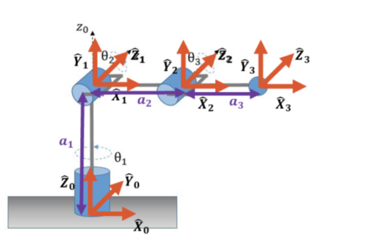
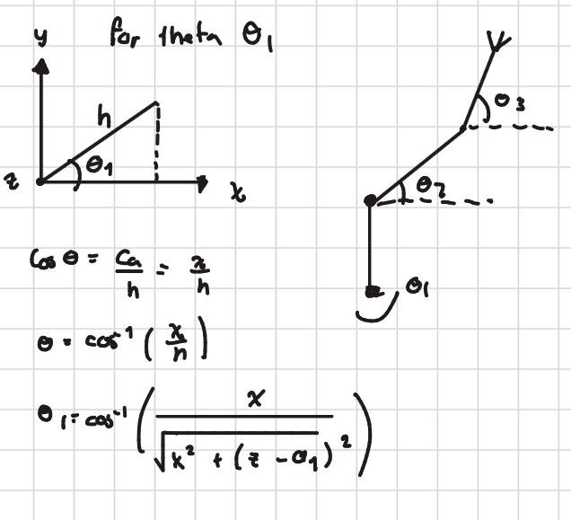
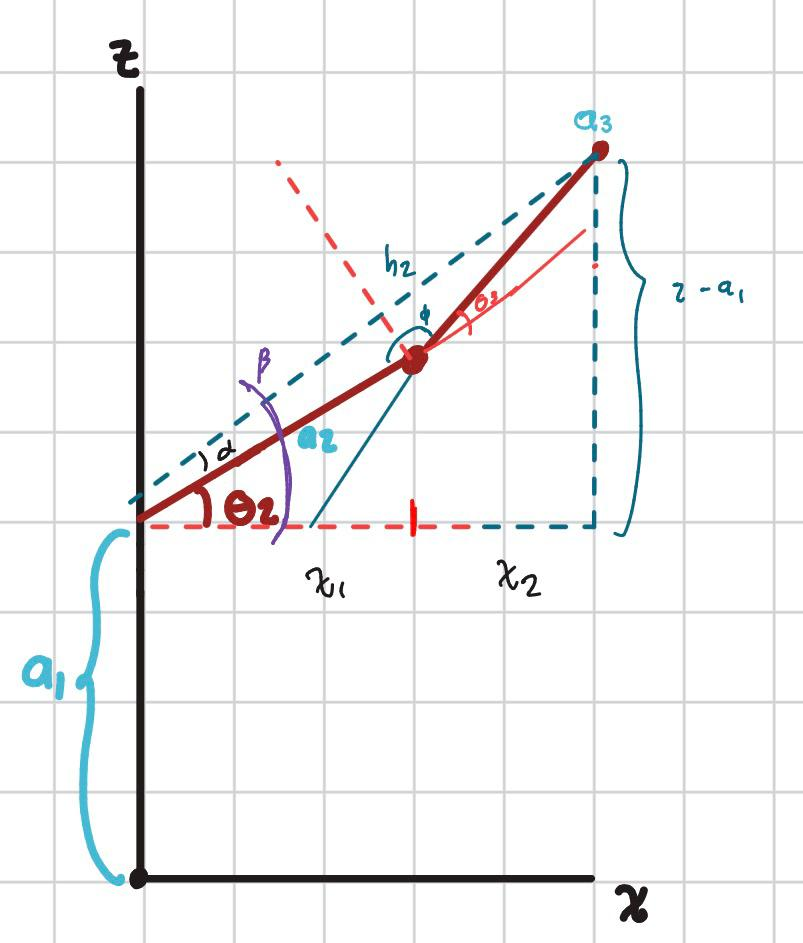
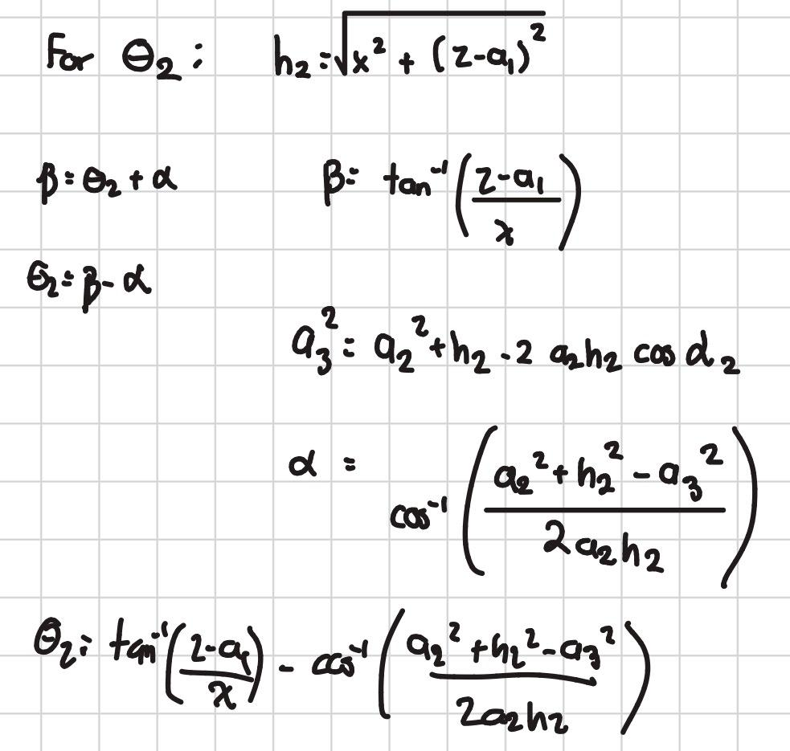
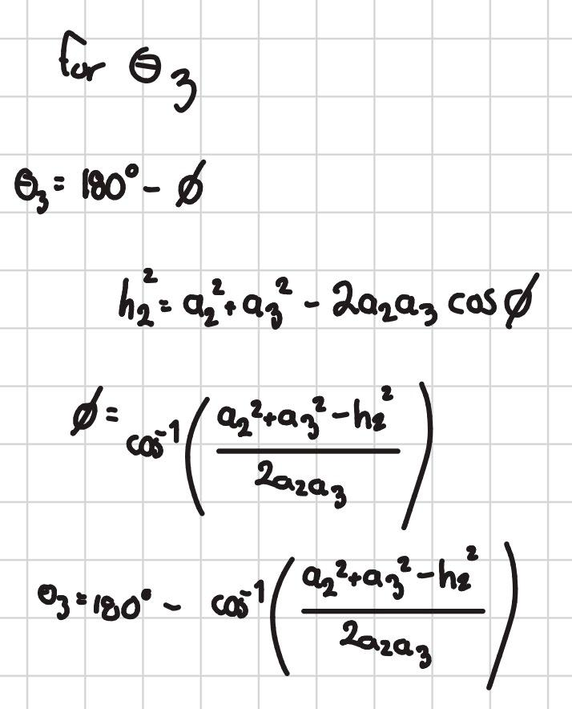
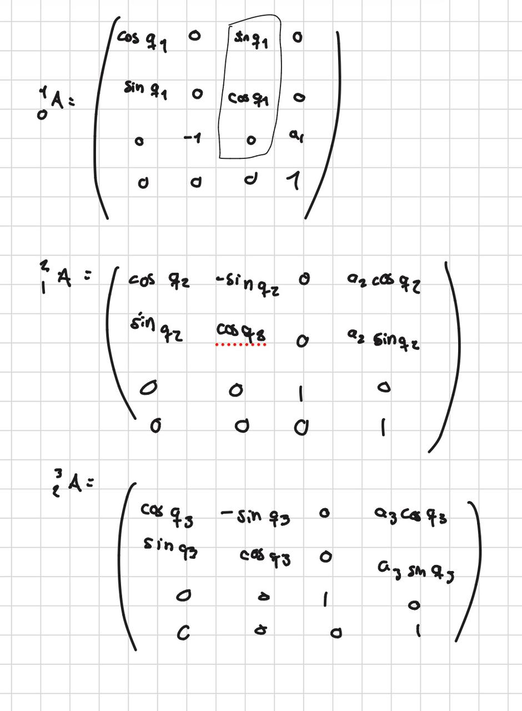
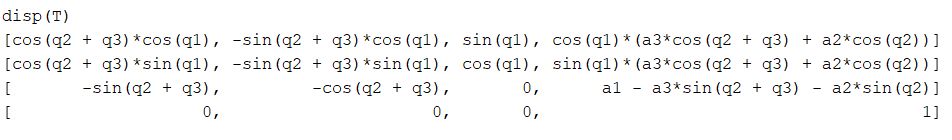

#  Inverse Kinematics 

Activity: For the robot shown, determine the inverse kinematics (IK) using the geometric approach and compute its Jacobian. The Jacobian can be obtained either through the algebraic method or the geometric method.

## Inverse kinematics using the geometric approach:

In this scenario, the robot has 3 degrees of freedom (DOF) with three revolute joints. The inverse kinematics can be solved using the geometric method, which consists of dividing the problem into simpler parts and applying trigonometric relationships to determine the joint angles.



Now we amplied the geometric method to find how theta 1,2 and 3 are working

to find θ1 we amplied a fornt view of the robot the axis xz


to find θ2 and θ3 we amplied a top view of the robot the axis xy


then using geometric and trigonometric knowledge we can get both thetas




## Jacobian Calculation
The Jacobian matrix establishes the relationship between the joint velocities and the velocity of the end-effector. It can be obtained through either the algebraic approach or the geometric approach. In this case, the Jacobian will be derived using the geometric method, which consists of computing the partial derivatives of the end-effector position with respect to each joint variable.

1. DH Parameters:
Before computing the Jacobian, it is necessary to define the Denavit–Hartenberg (DH) parameters of the robot. These parameters provide a standardized representation of a robot’s kinematic configuration. For the 3-DOF robot considered here, the DH parameters can be defined as follows.

| Link | α (alpha) | a (link length) | d (link offset) | θ (joint angle) |
|-----:|:---------:|:---------------:|:---------------:|:---------------:|
| 1 | -π/2 | 0 | L1 | q1 |
| 2 | 0 | L2 | 0 | q2 |
| 3 | 0 | L3 | 0 | q3 |

2. Transformation Matrices: Next, we can calculate the transformation matrices for each joint using the DH parameters. The transformation matrix for each joint can be calculated using the following formula:




now using matlab me multiply al the 3 matrix to find the final matrix

```text
% Definir variables simbólicas
syms q1 q2 q3 a1 a2 a3 

% Matriz A
A = [cos(q1) 0 sin(q1) 0;
     sin(q1) 0 cos(q1) 0;
     0 -1 0 a1;
     0 0 0 1];

% Matriz B
B = [cos(q2) -sin(q2) 0 a2*cos(q2);
     sin(q2)  cos(q2) 0 a2*sin(q2);
     0 0 1 0;
     0 0 0 1];

% Matriz C
C = [cos(q3) -sin(q3) 0 a3*cos(q3);
     sin(q3)  cos(q3) 0 a3*sin(q3);
     0 0 1 0;
     0 0 0 1];

% Multiplicación de matrices
T = A * B * C;

% Simplificar resultado
T = simplify(T);

% Mostrar resultado
disp(T)

```
to obtain 



3. derivate partial 

for this task we only need the values of the position so we only need to derivate 3 parts

```text
>> % Calcular las derivadas parciales
J = jacobian(T(1:3,4), [q1, q2, q3]);
>> % Simplificar el resultado
J = simplify(J);
>> % Mostrar el resultado
disp(J)
[-sin(q1)*(a3*cos(q2 + q3) + a2*cos(q2)), -cos(q1)*(a3*sin(q2 + q3) + a2*sin(q2)), -a3*sin(q2 + q3)*cos(q1)]
[ cos(q1)*(a3*cos(q2 + q3) + a2*cos(q2)), -sin(q1)*(a3*sin(q2 + q3) + a2*sin(q2)), -a3*sin(q2 + q3)*sin(q1)]
[                                      0,          - a3*cos(q2 + q3) - a2*cos(q2),         -a3*cos(q2 + q3)]
```

This makes it possible to analyze how variations in the joint angles influence the position of the end-effector, which is essential for applications such as motion planning and robotic control.
