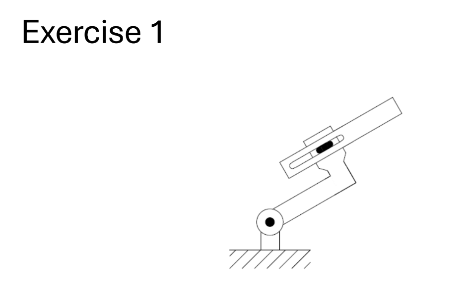
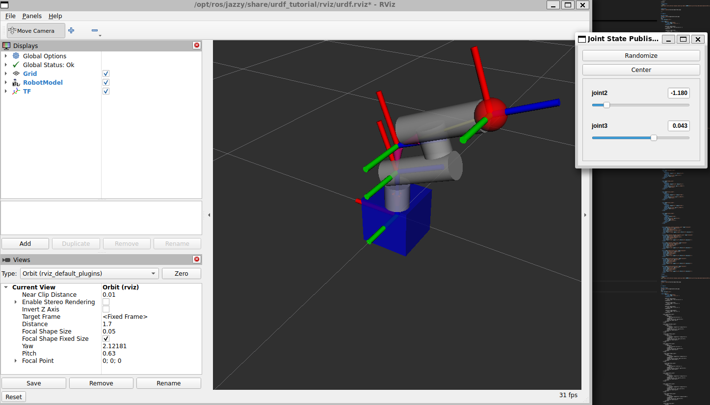
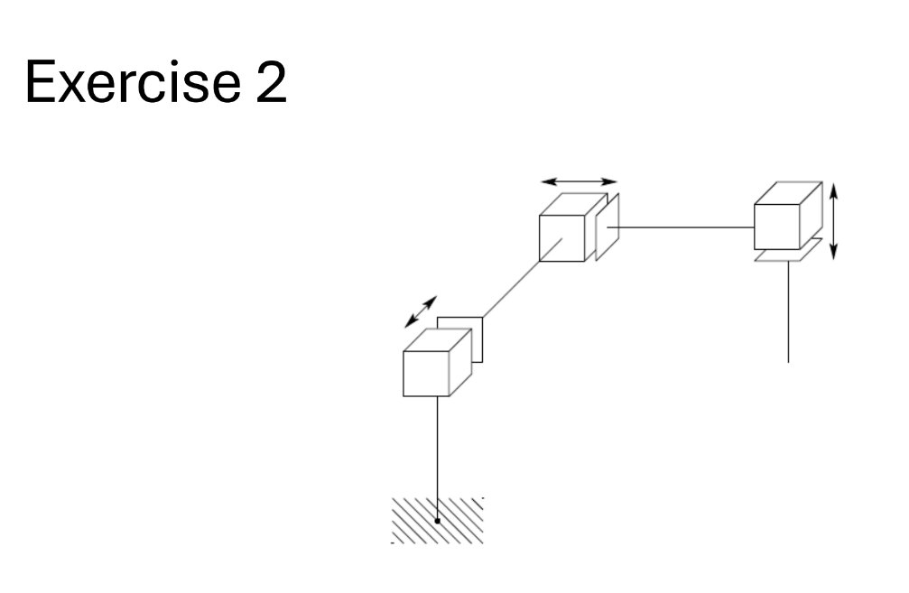
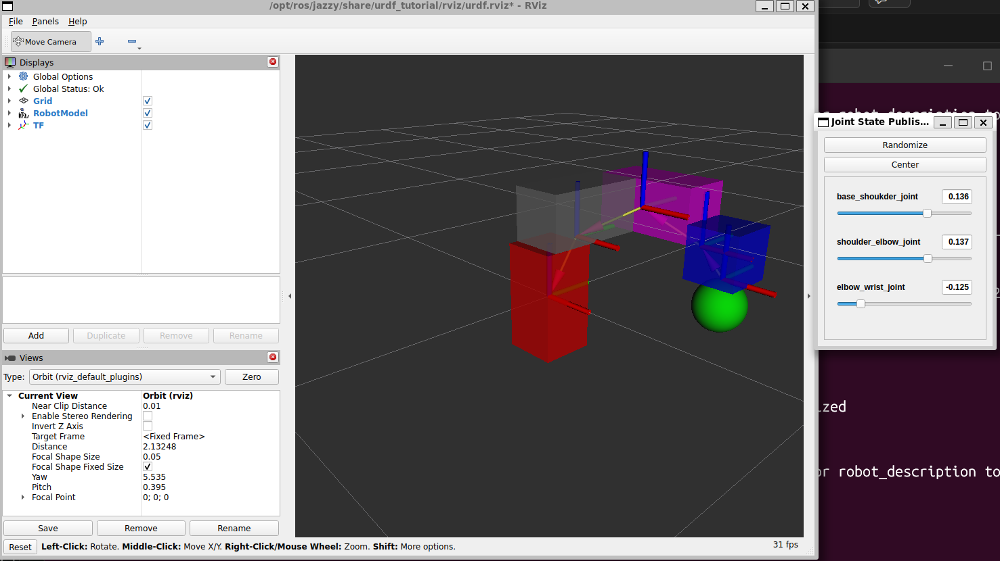
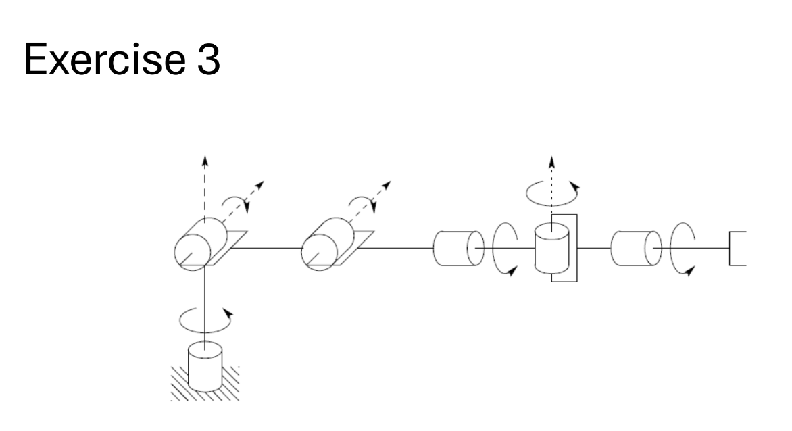
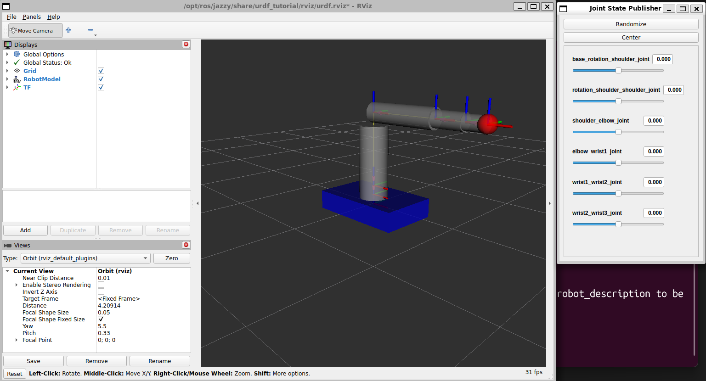
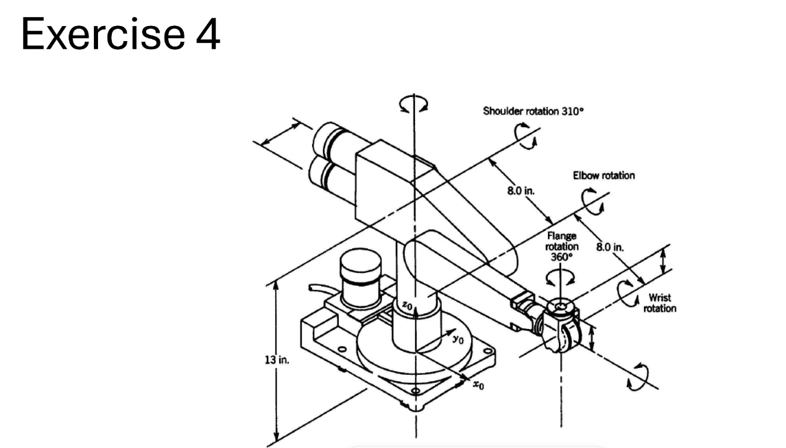
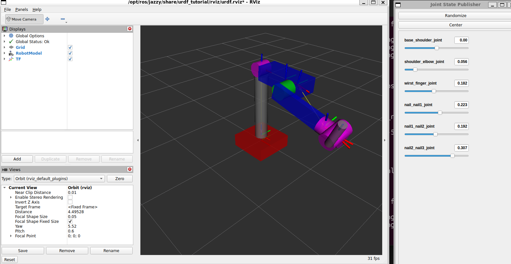
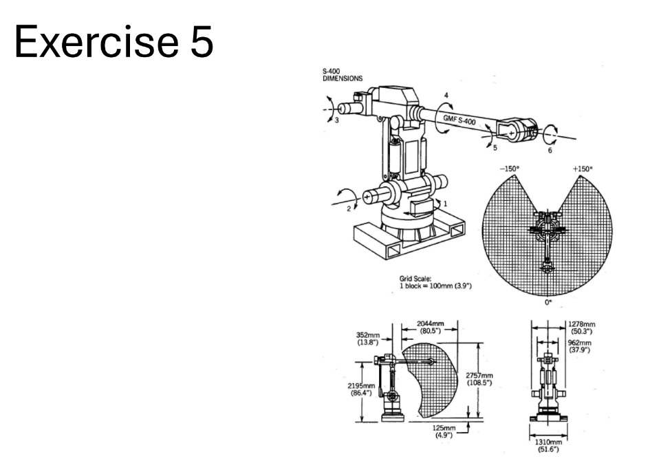
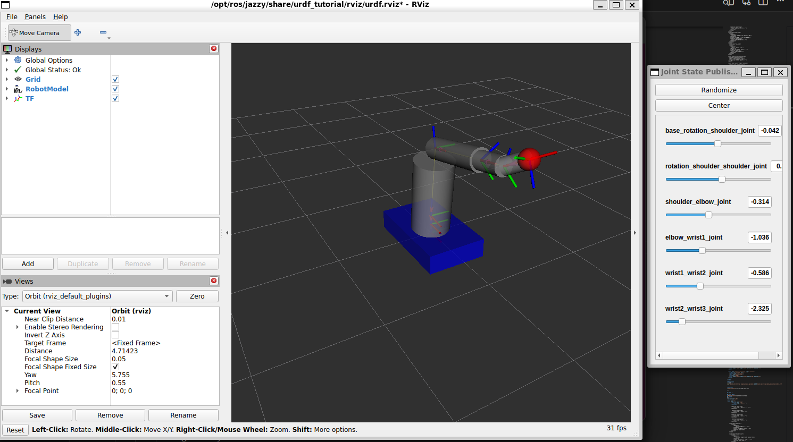

# activity 5 Robots URDF #

This activity consist en replicated 5 robots in a simple model 3D of linux to model the movement of any robtos using 3 geometric figures (cylinder, cube and sphere). Also this urdf model can add joints, limits and links to perfectly simulate any Robot

The lengauge code is XML format; Each robot has its own URDF file, launch configuration, and visualization screenshots.

---

#  Robot 1

## Robot Photo


## code 1

```text
<?xml version="1.0"?>
<robot name="my_robot">
 <link name="base_link">
    <visual>
      <geometry>
        <box size="0.2 0.2 0.2"/>
      </geometry>
      <origin xyz="0 0 0" rpy="0 0 0"/>
      <material name="blue">
        <color rgba="0 0 1 1"/>
      </material>
    </visual>
  </link>
  <link name="shoulder_link">
    <visual>
      <geometry>
        <cylinder length="0.1" radius="0.05"/>
      </geometry>
      <origin xyz="0 0 0.1" rpy="0 0 0"/>
      <material name="gray">
        <color rgba="0.7 0.7 0.7 1"/>
      </material>
    </visual> 
  </link>
  <link name="shoulder_extension_link">
    <visual>
      <geometry>
        <cylinder length="0.3" radius="0.05"/>
      </geometry>
      <origin xyz="0 0 0.1" rpy="0 0 0"/>
      <material name="gray">
        <color rgba="0.7 0.7 0.7 1"/>
      </material>
    </visual>
       <visual>
      <geometry>
        <cylinder length="0.1" radius="0.05"/>
      </geometry>
      <origin xyz="0.1 0 0.2" rpy="0 1.5708 0"/>
      <material name="gray">
        <color rgba="0.7 0.7 0.7 1"/>
      </material>
    </visual>
  </link>
  <link name="elbow_link">
    <visual>
      <geometry>
        <cylinder length="0.3" radius="0.05"/>
      </geometry>
      <origin xyz="0.05 0 0.2" rpy="0 0 0"/>
      <material name="gray">
        <color rgba="0.7 0.7 0.7 1"/>
      </material>
    </visual>
  </link>
    <link name="tip_link">
    <visual>
      <geometry>
        <sphere radius="0.05"/>
      </geometry>
      <origin xyz="0 0 0" rpy="0 0 0"/>
      <material name="red">
        <color rgba="1 0 0 1"/>
      </material>
    </visual>
  </link>

  <joint name="joint1" type="fixed">
    <parent link="base_link"/>
    <child link="shoulder_link"/>
    <origin xyz="0 0 0" rpy="0 0 0"/>
  </joint>

  <joint name="joint2" type="revolute">
    <parent link="shoulder_link"/>
    <child link="shoulder_extension_link"/>
    <origin xyz="0 0 0.2" rpy="0 0 0"/>
    <axis xyz="0 1 0"/>
    <limit lower="-1.57" upper="1.57" effort="10" velocity="1"/>
  </joint>
  <joint name="joint3" type="prismatic">
    <parent link="shoulder_extension_link"/>
    <child link="elbow_link"/>
    <origin xyz="0.1 0 0" rpy="0 0 0"/>
    <axis xyz="0 0 1"/>
    <limit lower="-0.15" upper="0.15" effort="10" velocity="1"/>
  </joint>
  <joint name="joint4" type="fixed">
    <parent link="elbow_link"/>
    <child link="tip_link"/>
    <origin xyz="0.05 0 0.375" rpy="0 0 0"/>
  </joint>
   
</robot>
```
**Execution**
```bash
ros2 launch urdf_tutorial display.launch.py model:=$HOME/hector_ws/src/my_robot_description/urdf/1.urdf
```

**Results**


---

#  Robot 2

## Robot Photo

## code 2
```text
<?xml version="1.0"?>

<robot name="2">
        <material name="blue">
            <color rgba = "0 0 1 1" />
        </material>

        <material name="gray">
            <color rgba = "0.5 0.5 0.5 1" />
        </material>

         <material name="red">
            <color rgba = "1 0 0 1" />
        </material>

        <material name="pink">
            <color rgba = "1 0 1 1" />
        </material>

        <material name="green">
            <color rgba = "0 1 0 1" />
        </material>

    <link name="base_link">
        <visual>
            <geometry>
                <box size="0.2 0.2 0.4" />
            </geometry>
            <origin xyz="0 0 0" rpy="0 0 0"/>
            <material name="red"/>
        </visual>
    </link>

    <link name="shoulder_link">
        <visual>
            <geometry>
                <box size="0.2 0.2 0.4" />
            </geometry>
            <origin xyz="0 0 0.1" rpy="1.57 0 0"/>
            <material name="gray"/>
        </visual>
    </link>

    <link name="elbow_link">
        <visual>
            <geometry>
                <box size="0.2 0.2 0.4" />
            </geometry>
            <origin xyz="0 0.1 0" rpy="0 1.57 0"/>
            <material name="pink"/>
        </visual>
    </link>

    
    <link name="wrist_link">
        <visual>
            <geometry>
                <box size="0.2 0.2 0.2" />
            </geometry>
            <origin xyz="0.1 0 0" rpy="0 0 0"/>
            <material name="blue"/>
        </visual>
    </link>
    
        
    <link name="tip_link">
        <visual>
            <geometry>
                <sphere radius="0.1"/>
            </geometry>
            <origin xyz="0 0 -0.1" rpy="0 0 0"/>
            <material name="green"/>
        </visual>
    </link>


    <joint name="base_shoukder_joint" type="prismatic">
        <parent link="base_link"/>
        <child link="shoulder_link"/>
        <origin xyz="0 0 0.2" rpy="0 0 0"/>
        <axis xyz="0 1 0"/>
        <limit lower="0.0" upper="0.2" effort="100" velocity="100"/>
    </joint>

    <joint name="shoulder_elbow_joint" type="prismatic">
        <parent link="shoulder_link"/>
        <child link= "elbow_link"/>
         <origin xyz="0 0.2 0.1" rpy="0 0 0"/>
        <axis xyz="1 0 0"/>
        <limit lower="0.0" upper="0.2" effort="100" velocity="100"/>
    </joint>

    <joint name="elbow_wrist_joint" type="prismatic">
        <parent link="elbow_link"/>
        <child link="wrist_link"/>
        <origin xyz="0.2 0.1 0" rpy="0 0 0"/>
        <axis xyz="0 0 1"/>
        <limit lower="-0.18" upper="0.18" effort="100" velocity="100"/>
    </joint>

       <joint name="wrist_tip_joint" type="fixed">
        <parent link="wrist_link"/>
        <child link="tip_link"/>
        <origin xyz="0.1 0 -0.1" rpy="0 0 0"/>
    </joint> 


</robot>
```

**Execution**
```bash
ros2 launch urdf_tutorial display.launch.py model:=$HOME/hector_ws/src/my_robot_description/urdf/2.urdf
```

**Results**


---

#  Robot 3

## Robot Photo

## code 3
```text

<?xml version="1.0"?>
<robot name="my_robot">


  <link name="base_link">
    <visual>
      <geometry>
        <box size="1 0.6 0.2"/>
      </geometry>
      <origin xyz="0 0 0" rpy="0 0 0"/>
      <material name="blue">
        <color rgba="0 0 1 1"/>
      </material>
    </visual>
  </link>

  <link name="rotation_shoulder_link">
    <visual>
      <geometry>
        <cylinder length="0.01" radius="0.01"/>
      </geometry>
      <origin xyz="0 0 0.005" rpy="0 0 0"/>
      <material name="gray">
        <color rgba="0.6 0.6 0.6 1"/>
      </material>
    </visual>
  </link>

  <link name="shoulder_link">
    <visual>
      <geometry>
        <cylinder length="0.75" radius="0.15"/>
      </geometry>
      <origin xyz="0 0 0.25" rpy="0 0 0"/>
      <material name="gray"/>
    </visual>
  </link>

 
  <link name="elbow_link">
    <visual>
      <geometry>
        <cylinder length="0.75" radius="0.1"/>
      </geometry>
      <origin xyz="0.375 0 0" rpy="0 1.5708 0"/>
      <material name="gray"/>
    </visual>
  </link>

 
  <link name="wrist_link1">
    <visual>
      <geometry>
        <cylinder length="0.3" radius="0.08"/>
      </geometry>
      <origin xyz="0.15 0 0" rpy="0 1.5708 0"/>
      <material name="gray"/>
    </visual>
  </link>

 
  <link name="wrist_link2">
    <visual>
      <geometry>
        <cylinder length="0.2" radius="0.07"/>
      </geometry>
      <origin xyz="0.1 0 0" rpy="0 1.5708 0"/>
      <material name="gray"/>
    </visual>
  </link>

 
  <link name="wrist_link3">
    <visual>
      <geometry>
        <sphere radius="0.08"/>
      </geometry>
      <origin xyz="0 0 0" rpy="0 0 0"/>
      <material name="red">
        <color rgba="1 0 0 1"/>
      </material>
    </visual>
  </link>


  <joint name="base_rotation_shoulder_joint" type="revolute">
    <origin xyz="0 0 0.1" rpy="0 0 0"/>
    <parent link="base_link"/>
    <child link="rotation_shoulder_link"/>
    <axis xyz="0 0 1"/>
    <limit lower="-2.618" upper="2.618" effort="10" velocity="1"/>
  </joint>

  <joint name="rotation_shoulder_shoulder_joint" type="revolute">
    <origin xyz="0 0 0.1" rpy="0 0 0"/>
    <parent link="rotation_shoulder_link"/>
    <child link="shoulder_link"/>
    <axis xyz="0 1 0"/>
    <limit lower="-1.57" upper="1.57" effort="10" velocity="1"/>
  </joint>

  <joint name="shoulder_elbow_joint" type="revolute">
    <origin xyz="0 0 0.75" rpy="0 0 0"/>
    <parent link="shoulder_link"/>
    <child link="elbow_link"/>
    <axis xyz="0 1 0"/>
    <limit lower="-1.57" upper="1.57" effort="10" velocity="1"/>
  </joint>

  <joint name="elbow_wrist1_joint" type="revolute">
    <origin xyz="0.75 0 0" rpy="0 0 0"/>
    <parent link="elbow_link"/>
    <child link="wrist_link1"/>
    <axis xyz="1 0 0"/>
    <limit lower="-3.14" upper="3.14" effort="10" velocity="1"/>
  </joint>

  <joint name="wrist1_wrist2_joint" type="revolute">
    <origin xyz="0.3 0 0" rpy="0 0 0"/>
    <parent link="wrist_link1"/>
    <child link="wrist_link2"/>
    <axis xyz="0 0 1"/>
    <limit lower="-1.57" upper="1.57" effort="10" velocity="1"/>
  </joint>

  <joint name="wrist2_wrist3_joint" type="revolute">
    <origin xyz="0.2 0 0" rpy="0 0 0"/>
    <parent link="wrist_link2"/>
    <child link="wrist_link3"/>
    <axis xyz="1 0 0"/>
    <limit lower="-3.14" upper="3.14" effort="10" velocity="1"/>
  </joint>

</robot>
```

**Execution**
```bash
ros2 launch urdf_tutorial display.launch.py model:=$HOME/hector_ws/src/my_robot_description/urdf/3.urdf
```

**Results**


---

#  Robot 4

## Robot Photo

## code 4
```text
<?xml version="1.0"?>

<robot name="4">
        <material name="blue">
            <color rgba = "0 0 1 1" />
        </material>

        <material name="gray">
            <color rgba = "0.5 0.5 0.5 1" />
        </material>

         <material name="red">
            <color rgba = "1 0 0 1" />
        </material>

        <material name="pink">
            <color rgba = "1 0 1 1" />
        </material>

         <material name="green">
            <color rgba = "0 1 0 1" />
        </material>
        
    <link name="base_link">
        <visual>
            <geometry>
                <box size="0.6 0.6 0.2" />
            </geometry>
            <origin xyz="0 0 0" rpy="0 0 0"/>
            <material name="red"/>
        </visual>
    </link>

    <link name="shoulder_link">
        <visual>
            <geometry>
                <cylinder length="1.0" radius="0.1"/>
            </geometry>
            <origin xyz="0 0 0.5" rpy="0 0 0"/>
            <material name="gray"/>
        </visual>
    </link>

     <link name="elbow_link">
        <visual>
            <geometry>
                <cylinder length="0.2" radius="0.1"/>
            </geometry>
            <origin xyz="0 0 0.0" rpy="1.57 0 0"/>
            <material name="pink"/>
        </visual>
    </link>

    <link name="wrist_link">
        <visual>
            <geometry>
                <box size="0.7 0.3 0.2" />
            </geometry>
            <origin xyz="0 0 0" rpy="0 0 0"/>
            <material name="blue"/>
        </visual>
    </link>

      <link name="finger_link">
        <visual>
            <geometry>
                <cylinder length="0.2" radius="0.1"/>
            </geometry>
            <origin xyz="0 -0.25 0" rpy="1.57 0 0"/>
            <material name="green"/>
        </visual>
    </link>

       <link name="nail_link">
        <visual>
            <geometry>
                <box size="0.7 0.07 0.2" />
            </geometry>
            <origin xyz="0.3 -0.35 0" rpy="0 0 0"/>
            <material name="blue"/>
        </visual>
    </link>

    <link name="nail1_link">
        <visual>
            <geometry>
                <cylinder length="0.3" radius="0.1"/>
            </geometry>
            <origin xyz="0.1 0 0" rpy="0 1.57 0"/>
            <material name="pink"/>
        </visual>
    </link>


    <link name="nail2_link">
        <visual>
            <geometry>
                <cylinder length="0.3" radius="0.1"/>
            </geometry>
            <origin xyz="0 0 0" rpy="1.57 0 0"/>
            <material name="pink"/>
        </visual>
    </link>

      <link name="nail3_link">
        <visual>
            <geometry>
                <cylinder length="0.4" radius="0.05"/>
            </geometry>
            <origin xyz="0 0 0" rpy="0 0 0"/>
            <material name="gray"/>
        </visual>
    </link>

     <link name="tip_link">
        <visual>
            <geometry>
                <sphere radius="0.05"/>
            </geometry>
            <origin xyz="0 0 -0.2" rpy="0 0 0"/>
            <material name="red"/>
        </visual>
    </link>

    
   <joint name="base_shoulder_joint" type="revolute">
        <origin xyz="0 0 0.1" rpy="0 0 0"/>
        <parent link="base_link"/>
        <child link= "shoulder_link"/>
        <axis xyz="0 0 1"/>
        <limit lower="-1.57" upper="1.57" effort="100" velocity="100"/>
    </joint>

    <joint name="shoulder_elbow_joint" type="revolute">
        <origin xyz="0 0 1.1" rpy="0 0 0"/>
        <parent link="shoulder_link"/>
        <child link= "elbow_link"/>
        <axis xyz="0 1 0"/>
        <limit lower="0.0" upper="0.4" effort="100" velocity="100"/>
    </joint>

       <joint name="elbow_wrist_joint" type="fixed">
        <parent link="elbow_link"/>
        <child link="wrist_link"/>
        <origin xyz="0.45 0 0.0" rpy="0 0 0"/>
    </joint> 

    <joint name="wirst_finger_joint" type="revolute">
        <origin xyz="0.2 0 0" rpy="0 0 0"/>
        <parent link="wrist_link"/>
        <child link= "finger_link"/>
        <axis xyz="0 1 0"/>
        <limit lower="0.0" upper="0.4" effort="100" velocity="100"/>
    </joint>

      <joint name="finger_nailt_joint" type="fixed">
        <parent link="finger_link"/>
        <child link="nail_link"/>
        <origin xyz="0 0 0.0" rpy="0 0 0"/>
    </joint> 

     <joint name="nail_nail1_joint" type="revolute">
        <origin xyz="0.7 -0.35 0" rpy="0 0 0"/>
        <parent link="nail_link"/>
        <child link= "nail1_link"/>
        <axis xyz="1 0 0"/>
        <limit lower="0.0" upper="0.4" effort="100" velocity="100"/>
    </joint>

     <joint name="nail1_nail2_joint" type="revolute">
        <origin xyz="0.15 0 0" rpy="0 0 0"/>
        <parent link="nail1_link"/>
        <child link= "nail2_link"/>
        <axis xyz="0 1 0"/>
        <limit lower="0.0" upper="0.4" effort="100" velocity="100"/>
    </joint>

     <joint name="nail2_nail3_joint" type="revolute">
        <origin xyz="0 0 0" rpy="0 0 0"/>
        <parent link="nail2_link"/>
        <child link= "nail3_link"/>
        <axis xyz="0 0 1"/>
        <limit lower="0.0" upper="0.4" effort="100" velocity="100"/>
    </joint>

         <joint name="nail3_tip_joint" type="fixed">
        <parent link="nail3_link"/>
        <child link="tip_link"/>
        <origin xyz="0 0 0.0" rpy="0 0 0"/>
    </joint> 

</robot>
```

**Execution**
```bash
ros2 launch urdf_tutorial display.launch.py model:=$HOME/hector_ws/src/my_robot_description/urdf/4.urdf
```

**Results**


---

#  Robot 5

## Robot Photo


## code 5
```text
<?xml version="1.0"?>
<robot name="my_robot">


  <link name="base_link">
    <visual>
      <geometry>
        <box size="1 0.6 0.2"/>
      </geometry>
      <origin xyz="0 0 0" rpy="0 0 0"/>
      <material name="blue">
        <color rgba="0 0 1 1"/>
      </material>
    </visual>
  </link>

  <link name="rotation_shoulder_link">
    <visual>
      <geometry>
        <cylinder length="0.01" radius="0.01"/>
      </geometry>
      <origin xyz="0 0 0.005" rpy="0 0 0"/>
      <material name="gray">
        <color rgba="0.6 0.6 0.6 1"/>
      </material>
    </visual>
  </link>

  <link name="shoulder_link">
    <visual>
      <geometry>
        <cylinder length="0.75" radius="0.2"/>
      </geometry>
      <origin xyz="0 0 0.25" rpy="0 0 0"/>
      <material name="gray"/>
    </visual>
  </link>

 
  <link name="elbow_link">
    <visual>
      <geometry>
        <cylinder length="0.75" radius="0.1"/>
      </geometry>
      <origin xyz="0.375 0 0" rpy="0 1.5708 0"/>
      <material name="gray"/>
    </visual>
  </link>

 
  <link name="wrist_link1">
    <visual>
      <geometry>
        <cylinder length="0.3" radius="0.08"/>
      </geometry>
      <origin xyz="0.15 0 0" rpy="0 1.5708 0"/>
      <material name="gray"/>
    </visual>
  </link>

 
  <link name="wrist_link2">
    <visual>
      <geometry>
        <cylinder length="0.2" radius="0.07"/>
      </geometry>
      <origin xyz="0.1 0 0" rpy="0 1.5708 0"/>
      <material name="gray"/>
    </visual>
  </link>

 
  <link name="wrist_link3">
    <visual>
      <geometry>
        <sphere radius="0.08"/>
      </geometry>
      <origin xyz="0 0 0" rpy="0 0 0"/>
      <material name="red">
        <color rgba="1 0 0 1"/>
      </material>
    </visual>
  </link>


  <joint name="base_rotation_shoulder_joint" type="revolute">
    <origin xyz="0 0 0.1" rpy="0 0 0"/>
    <parent link="base_link"/>
    <child link="rotation_shoulder_link"/>
    <axis xyz="0 0 1"/>
    <limit lower="-2.618" upper="2.618" effort="10" velocity="1"/>
  </joint>

  <joint name="rotation_shoulder_shoulder_joint" type="revolute">
    <origin xyz="0 0 0.1" rpy="0 0 0"/>
    <parent link="rotation_shoulder_link"/>
    <child link="shoulder_link"/>
    <axis xyz="0 1 0"/>
    <limit lower="-1.57" upper="1.57" effort="10" velocity="1"/>
  </joint>

  <joint name="shoulder_elbow_joint" type="revolute">
    <origin xyz="0 0 0.75" rpy="0 0 0"/>
    <parent link="shoulder_link"/>
    <child link="elbow_link"/>
    <axis xyz="0 1 0"/>
    <limit lower="-1.57" upper="1.57" effort="10" velocity="1"/>
  </joint>

  <joint name="elbow_wrist1_joint" type="revolute">
    <origin xyz="0.75 0 0" rpy="0 0 0"/>
    <parent link="elbow_link"/>
    <child link="wrist_link1"/>
    <axis xyz="1 0 0"/>
    <limit lower="-3.14" upper="3.14" effort="10" velocity="1"/>
  </joint>

  <joint name="wrist1_wrist2_joint" type="revolute">
    <origin xyz="0.3 0 0" rpy="0 0 0"/>
    <parent link="wrist_link1"/>
    <child link="wrist_link2"/>
    <axis xyz="0 1 0"/>
    <limit lower="-1.57" upper="1.57" effort="10" velocity="1"/>
  </joint>

  <joint name="wrist2_wrist3_joint" type="revolute">
    <origin xyz="0.2 0 0" rpy="0 0 0"/>
    <parent link="wrist_link2"/>
    <child link="wrist_link3"/>
    <axis xyz="1 0 0"/>
    <limit lower="-3.14" upper="3.14" effort="10" velocity="1"/>
  </joint>

</robot>
```

**Execution**
```bash
ros2 launch urdf_tutorial display.launch.py model:=$HOME/hector_ws/src/my_robot_description/urdf/5.urdf
```

**Results**

