# Trajectory Planning

## Introduction

Trajectory planning is a fundamental concept in robotics, especially when controlling the motion of robot joints. It involves defining how a robot moves from one position to another over time, considering variables such as position, velocity, and acceleration. Proper trajectory planning ensures smooth, efficient, and safe movements, avoiding abrupt changes that could damage the system or reduce precision.

Two of the most common motion profiles used in joint trajectory planning are trapezoidal and triangular velocity profiles. These profiles describe how velocity changes over time. In a trapezoidal profile, the motion consists of three phases: acceleration, constant velocity, and deceleration. In contrast, a triangular profile occurs when the system does not reach a constant velocity phase, resulting in only acceleration and deceleration.

Understanding these motion profiles is essential for analyzing how joints behave under different constraints, such as maximum velocity and acceleration limits. These concepts are widely used in industrial robots, CNC machines, and automated systems.

In this work, we will solve six exercises focused on trajectory planning using velocity and acceleration profiles, applying both trapezoidal and triangular models to better understand their behavior and practical implementation.

## Exercise 1

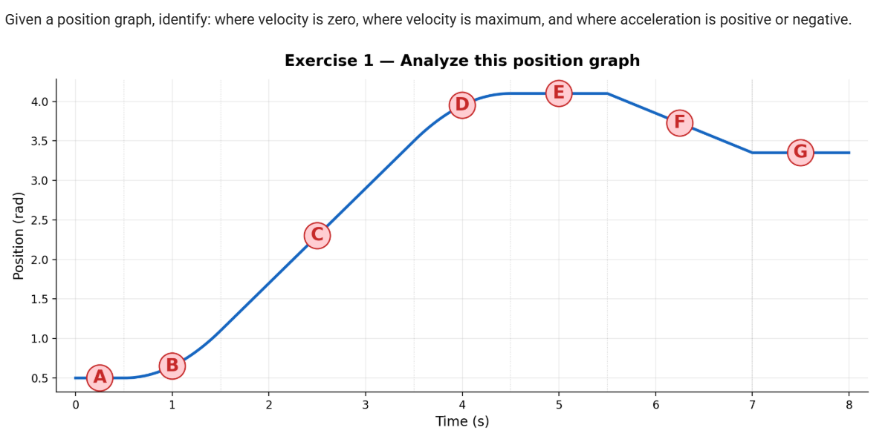

In this exercise viewing the graph we need to analysis where is accelerating, speed constant or its not moving

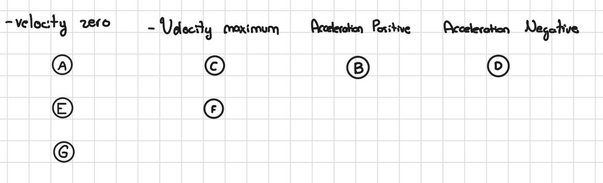

## Exercise 2

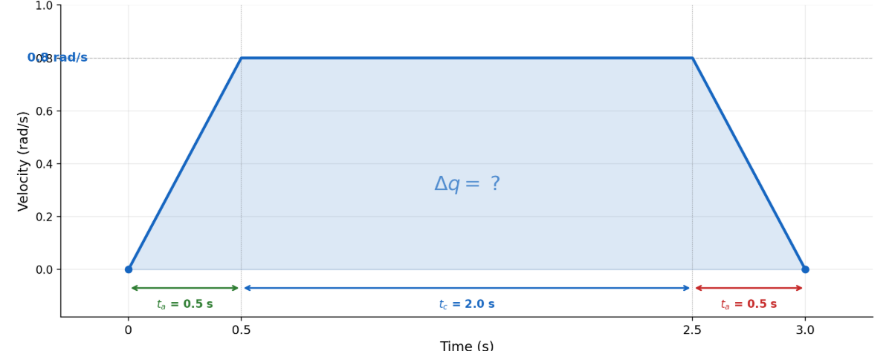

Given a trapezoidal velocity graph, compute total displacement from the area under the curve. For this we need to calculate the area of the trapezoidal in simply terms its the area of the two triangules and one rectangule.

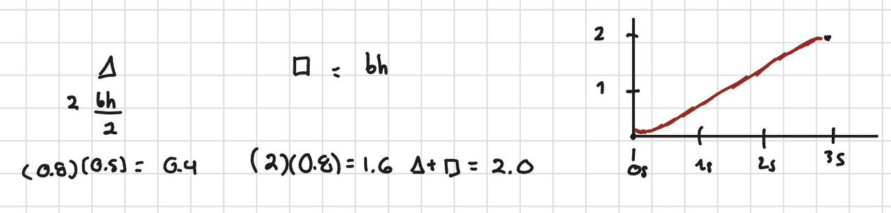

## Exercise 3
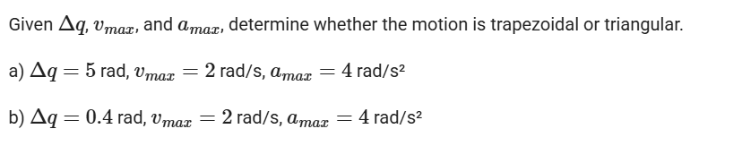

In this excercise we need to use a formula to know if the velocity profile has a trapezoidal or triangule having the data of the maximum velocity and maximum acceleration and the position.

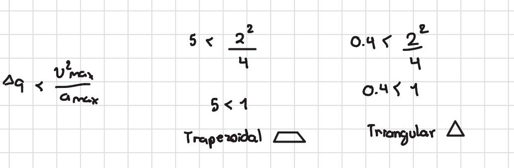

## Exercise 4
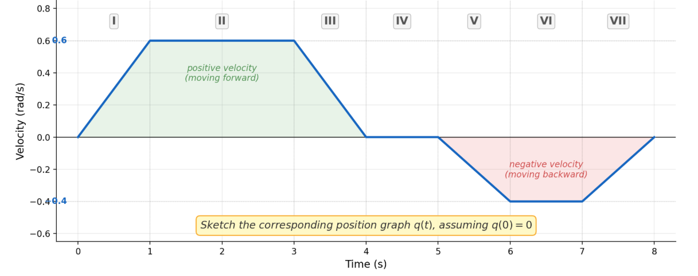
In this exercise we need to analysis the velocity profile to get a psotion graph

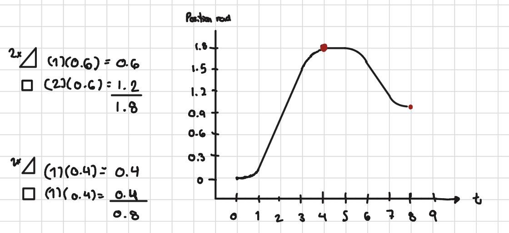

## Exercise 5

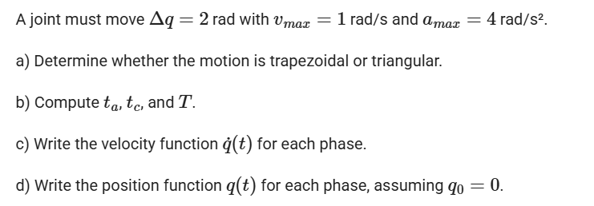
in the following subsections we need to use the formulas of each phase to calculate time velcotiy acceleration position.

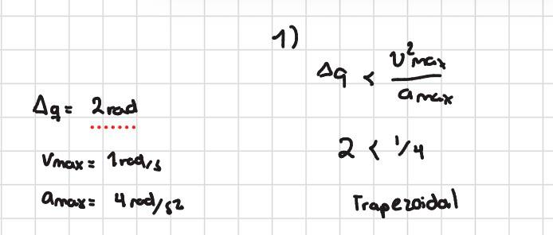
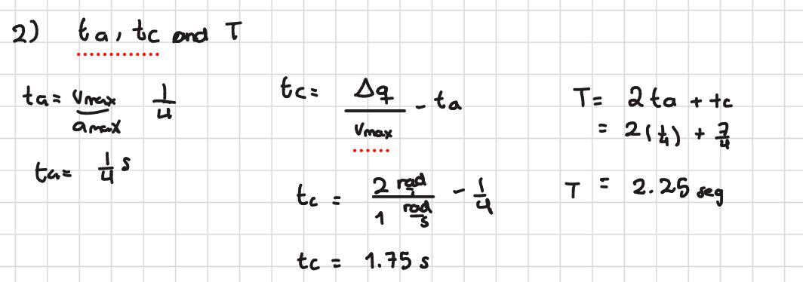
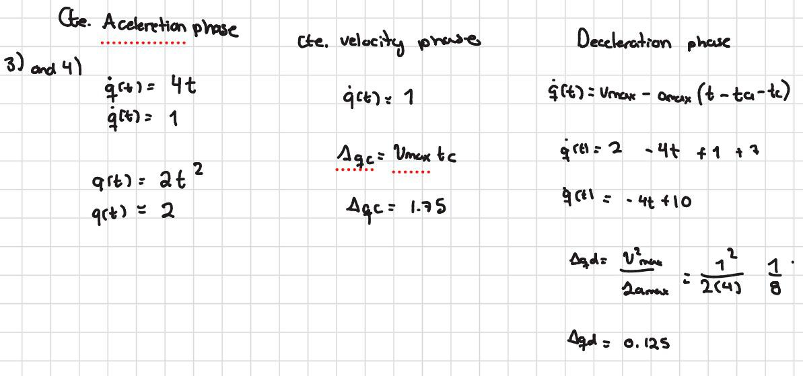

## Exercise 6

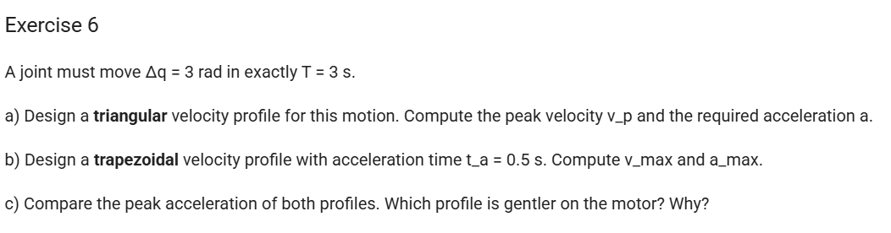

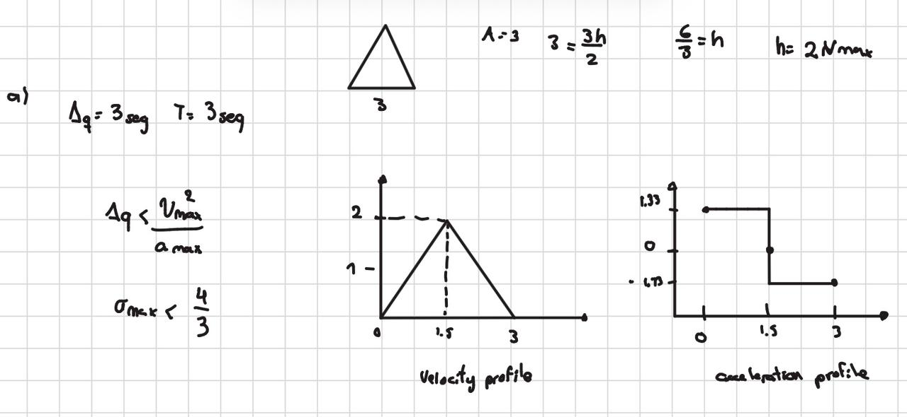
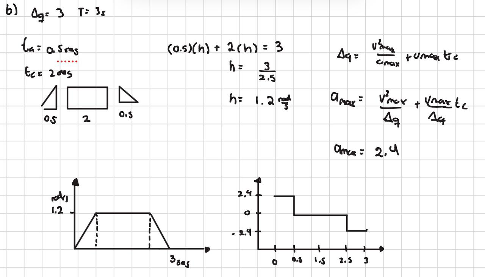

(C) The smoother profile its the acceleration of the trapezoidal beacuse has more step to get slower and no have a drastic fall to slow and then immediately has to accelerate in the opposite direction