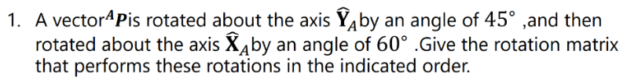
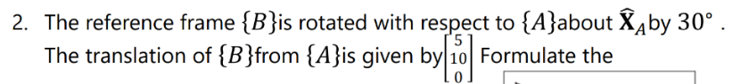
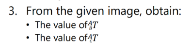

# Transform Nomenclature

**Solve the following exercises**

*Execirse 1*

First, the rotation about the y-axis by 45 degrees is calculated. Then, its rotation matrix is obtained. Next, the rotation matrix about the x-axis by 60 degrees is computed. The matrices are then multiplied from right to left, and finally, the resulting rotation matrix is obtained.

*Execirse 2*

In the second step, we compute the next rotation matrix, multiply it with the translation matrix, and then multiply by the necessary matrix to obtain a homogeneous transformation.

*Execirse 3*

In the third case,part one  we need to obtain the homogeneous transformation matrix from point A to point B. We verify that the Ax axis remains in the same position but with opposite direction, which means a 180-degree rotation. The axis that does not move is the Z-axis, so the calculations are performed about that axis. Then, it is observed that there is only a translation along the X-axis, so the coordinates are (3, 0, 0). Finally, we perform the matrix multiplication to obtain the homogeneous transformation matrix.

In the third case,part two we need to obtain the homogeneous transformation matrix from point A to point C. It is similar to the previous case, but with additional steps. We observe that the translation occurs only along the X and Y axes, with no movement along the Z-axis. Regarding the rotation, it can be seen that there are two rotations: one of 30 degrees and another of 90 degrees. The 90-degree rotation is observed because the Cx axis is displaced by 90 degrees, and the 30-degree rotation corresponds to the small inclination of the triangle. We perform the same calculations and obtain the homogeneous transformation matrix.
