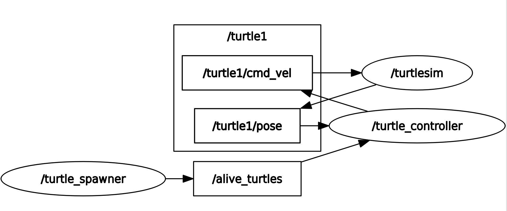

# Turtle Catcher Project

## Description

This project implements a ROS 2 system to control a turtle in *turtlesim* that
chases and catches other turtles spawned randomly. It consists of two main nodes:
one that controls the movement of the main turtle and another that handles the
spawning and management of alive turtles.

---

## Nodes Overview

- *turtle_controller*  
  - Subscribes to the main turtle’s position (/turtle1/pose)  
  - Subscribes to the list of alive turtles (/alive_turtles)  
  - Publishes velocity commands (/turtle1/cmd_vel)  
  - Calls the /catch_turtle service to remove a turtle once caught  

- *turtle_spawner*  
  - Spawns new turtles at random positions using the spawn service  
  - Publishes the list of alive turtles on the alive_turtles topic  
  - Provides the catch_turtle service to remove caught turtles  
  - Uses the kill service to remove turtles from the simulator  

---

# Source Codes

## turtle_controller.py

```python

import rclpy
from rclpy.node import Node
import math

from geometry_msgs.msg import Twist
from turtlesim.msg import Pose

from hector_interfaces.msg import TurtleArray, Turtle
from hector_interfaces.srv import CatchTurtle

class TurtleController(Node):

    def __init__(self):
        super().__init__("turtle_controller")

        self.publish_ = self.create_publisher(Twist,"/turtle1/cmd_vel",10)

        self.create_timer(0.01, self.timer_callback)

        self.pose_sub = self.create_subscription(Pose,"/turtle1/pose",self.subs_callback,10)
        self.alive_sub = self.create_subscription(TurtleArray,"/alive_turtles",self.alive_callback,10)

        self.catch_client = self.create_client(CatchTurtle, "/catch_turtle")

        self.current_pose = None
        self.list_turtles = []
        self.target = None

        self.declare_parameter("k_linear", 2.0)
        self.declare_parameter("k_i_linear", 0.0)

        self.declare_parameter("k_angular", 6.0)
        self.declare_parameter("k_i_angular", 0.0)

        self.k_linear = self.get_parameter("k_linear").value
        self.k_i_linear = self.get_parameter("k_i_linear").value

        self.k_angular = self.get_parameter("k_angular").value
        self.k_i_angular = self.get_parameter("k_i_angular").value

        # Integrales
        self.integral_linear = 0.0
        self.integral_angular = 0.0

        # Timer
        self.dt = 0.01
        self.create_timer(self.dt, self.timer_callback)

    def subs_callback(self, msg: Pose):
        self.current_pose = msg

    def alive_callback(self, msg):
        self.list_turtles = msg.turtles

    def timer_callback(self):

        if self.target is None and len(self.list_turtles) > 0:
            self.target = self.list_turtles[0]

        if self.current_pose is None:
            return

        if self.target is None:
            return

        dx = self.target.x - self.current_pose.x
        dy = self.target.y - self.current_pose.y

        distance = math.sqrt(dx**2 + dy**2)

        angle_to_target = math.atan2(dy, dx)
        angle_error = angle_to_target - self.current_pose.theta

        # Normalizar ángulo
        angle_error = math.atan2(
            math.sin(angle_error),
            math.cos(angle_error)
        )

        msg = Twist()
        msg.linear.x = self.k_linear * distance
        msg.angular.z = self.k_angular * angle_error

        # Si está cerca → matar
        if distance < 0.3:
            msg.linear.x = 0.0
            msg.angular.z = 0.0
            self.call_catch_service(self.target.name)
            self.target = None

        self.publish_.publish(msg)

    def call_catch_service(self, name):

        if not self.catch_client.wait_for_service(timeout_sec=1.0):
            self.get_logger().warn("Catch service not available")
            return

        request = CatchTurtle.Request()
        request.name = name

        future = self.catch_client.call_async(request)
        future.add_done_callback(self.catch_response)


    def catch_response(self, future):
        response = future.result()
        if response.success:
            self.get_logger().info("Turtle killed ")
        else:
            self.get_logger().warn("Failed to kill turtle")

def main(args=None):
    rclpy.init(args=args)
    node = TurtleController()
    rclpy.spin(node)
    node.destroy_node()
    rclpy.shutdown()


if __name__ == '__main__':
    main()
```

## turtle_spawner.py

```python
import rclpy
from rclpy.node import Node
import random
from turtlesim.srv import Spawn, Kill

from hector_interfaces.msg import Turtle, TurtleArray
from hector_interfaces.srv import CatchTurtle

class TurtleSpawner(Node):
    def __init__(self):
        super().__init__("turtle_spawner")
       
        self.declare_parameter("spawn_frequency", 1.0)
        self.declare_parameter("turtle_name_prefix", "turtle")

        self.spawn_frequency = self.get_parameter("spawn_frequency").value
        self.turtle_name_prefix = self.get_parameter("turtle_name_prefix").value

    
        self.alive_turtles = []

        self.alive_pub = self.create_publisher(TurtleArray, "alive_turtles", 10)

        if self.spawn_frequency > 0:
            self.create_timer(1.0 / self.spawn_frequency, self.spawn_turtle)

        self.spawn_client = self.create_client(Spawn, "spawn")
        self.kill_client = self.create_client(Kill, "kill")

    
        self.catch_service = self.create_service(
            CatchTurtle, "catch_turtle", self.catch_turtle_callback
        )

    def spawn_turtle(self):
        if not self.spawn_client.wait_for_service(timeout_sec=1.0):
            self.get_logger().warn("Spawn service not available")
            return

        req = Spawn.Request()
        req.x = random.uniform(0.5, 9.5)
        req.y = random.uniform(0.5, 9.5)
        req.theta = random.uniform(0.0, 6.28)
        req.name = f"{self.turtle_name_prefix}_{len(self.alive_turtles)}"

        future = self.spawn_client.call_async(req)
        future.add_done_callback(lambda f: self.add_turtle(req))

    def add_turtle(self, req):
        turtle = Turtle()
        turtle.name = req.name
        turtle.x = req.x
        turtle.y = req.y
        turtle.theta = req.theta
        self.alive_turtles.append(turtle)
        self.publish_alive()

    def catch_turtle_callback(self, request, response):
        name = request.name
        if not self.kill_client.wait_for_service(timeout_sec=1.0):
            self.get_logger().warn("Kill service not available")
            response.success = False
            return response

        kill_req = Kill.Request()
        kill_req.name = name
        future = self.kill_client.call_async(kill_req)


        self.alive_turtles = [t for t in self.alive_turtles if t.name != name]
        self.publish_alive()

        response.success = True
        return response

    def publish_alive(self):
        msg = TurtleArray()
        msg.turtles = self.alive_turtles
        self.alive_pub.publish(msg)


def main(args=None):
    rclpy.init(args=args)
    node = TurtleSpawner()
    rclpy.spin(node)
    rclpy.shutdown()

if __name__ == '__main__':
    main()
```

## turtle_launch.xml

```text
<launch>

    <node pkg="turtlesim" exec="turtlesim_node" name="turtlesim" />

    <node pkg="hector_turtle" exec="spwan">
        <param from="$(find-pkg-share hec_bringup)/config/turtle.yaml" />
    </node>

    <node pkg="hector_turtle" exec="conturt">
        <param from="$(find-pkg-share hec_bringup)/config/turtle.yaml" />
    </node>

</launch>
```

## turtle.yaml

```text
turtle_controller:
  ros__parameters:
    k_linear: 2.0
    k_angular: 6.0
    k_i_linear: 0.0
    k_i_angular: 0.0

turtle_spawner:
  ros__parameters:
    spawn_frequency: 1.1
    turtle_name_prefix: "turtle"
```

## Turtle.msg

```text
string name 
float32 x
float32 y
float32 theta
```

## TurtleArray.msg

```text
Turtle[] turtles
```

## CatchTurtle.srv

```text
string name
---
bool success
```

## Execution

```text
ros2 launch hec_bringup turtle_launch.xml
rqt_graph
```

## Terminal Output


## Demo Video
<div style="text-align:center;">
  <video controls style="width:100%; max-width:900px;">
    <source src="../imgs3/turtlesim_demo.mp4" type="video/mp4">
  </video>
</div>

## Results

